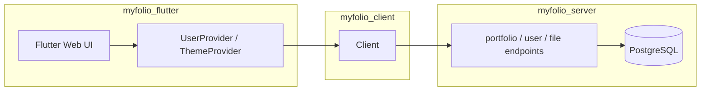

# MyFolio

Personal portfolio app built with Flutter (web-first) and [Serverpod](https://docs.serverpod.dev). The frontend is a responsive Flutter app; the backend is a Serverpod server backed by PostgreSQL.

**Live app:** [https://abhicodebugger.github.io/my_folio/](https://abhicodebugger.github.io/my_folio/)  
**API:** `https://my-folio-a91r.onrender.com`

## Monorepo structure

| Package | Path | Purpose |
|---------|------|---------|
| `myfolio_flutter` | [myfolio_flutter/](myfolio_flutter/) | Flutter app — UI, Provider state, auth session |
| `myfolio_server` | [myfolio_server/](myfolio_server/) | Serverpod 3.4.5 server — endpoints, Postgres, migrations |
| `myfolio_client` | [myfolio_client/](myfolio_client/) | Generated protocol client consumed by the Flutter app |



## Features

- Responsive layouts for mobile, tablet, and desktop
- Portfolio sections: roles, projects, skills, education, and experience
- Light/dark theme toggle
- Serverpod authentication via `serverpod_auth_idp_flutter`
- File upload endpoint for resume and assets

## Prerequisites

- Flutter **3.32+** (Dart SDK **3.8+**)
- Docker (local Postgres and Redis via [myfolio_server/docker-compose.yaml](myfolio_server/docker-compose.yaml))
- [Serverpod CLI](https://docs.serverpod.dev) (for `serverpod generate` after model or endpoint changes)

## Local development

### 1. Start the backend

```bash
cd myfolio_server
docker compose up --build -d
dart pub get
dart bin/main.dart --apply-migrations
```

Postgres runs on port **8090**, Redis on **8091**. The API is available at `http://localhost:8080`.

Database credentials are configured in [myfolio_server/config/development.yaml](myfolio_server/config/development.yaml) and [myfolio_server/config/passwords.yaml](myfolio_server/config/passwords.yaml) (not committed — copy from your team or Serverpod setup).

To stop services:

```bash
docker compose stop
```

### 2. Run the Flutter app (dev flavor)

```bash
cd myfolio_client && flutter pub get
cd ../myfolio_flutter && flutter pub get
flutter run -d chrome -t lib/main_dev.dart
```

The dev entry point (`lib/main_dev.dart`) connects to the local Serverpod server by default. You can override the API URL via `assets/config.json` or `--dart-define=API_URL=...`.

### Flavors and API URL resolution

| Entry point | Flavor | Default API |
|-------------|--------|-------------|
| `lib/main_dev.dart` | `dev` | `http://localhost:8080` (or `assets/config.json`) |
| `lib/main.dart` | `prod` | `https://my-folio-a91r.onrender.com` |

Resolution order (see [myfolio_flutter/lib/config/environment.dart](myfolio_flutter/lib/config/environment.dart)):

1. `--dart-define=API_URL=...` (highest priority — used in CI builds)
2. `assets/config.json` (`apiUrl` key) — dev flavor only
3. Built-in flavor default

### Regenerate the client after server changes

When you add or modify Serverpod models (`.spy` files) or endpoints:

```bash
cd myfolio_server
serverpod generate
```

## Build and deploy

### Production web build

Matches the [deploy workflow](.github/workflows/deploy.yml):

```bash
cd myfolio_flutter
flutter build web --release -t lib/main.dart \
  --base-href "/my_folio/" \
  --dart-define=API_URL=https://my-folio-a91r.onrender.com
```

Output is in `myfolio_flutter/build/web/`.

### Server deployment

The server Docker image is defined in [myfolio_server/Dockerfile](myfolio_server/Dockerfile). It applies database migrations on startup (`--apply-migrations`).

You can also build the Flutter app and copy it into the server's web directory:

```bash
cd myfolio_server
serverpod run flutter_build
```

### CI/CD

| Workflow | Trigger | What it does |
|----------|---------|--------------|
| [analyze.yml](.github/workflows/analyze.yml) | push/PR to `main` | Dart analyze on `myfolio_server` |
| [format.yml](.github/workflows/format.yml) | push/PR to `main` | Dart format check on `myfolio_server` |
| [tests.yml](.github/workflows/tests.yml) | push/PR to `main` | Server integration tests (Docker Postgres/Redis) |
| [deploy.yml](.github/workflows/deploy.yml) | push to `main` | Flutter web build → GitHub Pages |

## Testing

```bash
# Server integration tests (requires Docker)
cd myfolio_server
docker compose up -d
dart pub get
dart test
docker compose down -v

# Flutter unit and widget tests
cd myfolio_flutter
flutter test
```

CI currently runs server integration tests only; Flutter tests are run locally.

## Project layout

```
my_folio/
├── myfolio_flutter/     # Flutter app
│   ├── lib/
│   │   ├── bootstrap.dart
│   │   ├── config/      # environment / API URL
│   │   ├── providers/   # UserProvider, ThemeProvider
│   │   ├── screens/     # mobile, tablet, desktop layouts
│   │   └── widgets/     # tab content and shared UI
│   └── test/
├── myfolio_server/      # Serverpod server
│   ├── lib/src/endpoints/
│   ├── lib/src/models/  # .spy model definitions
│   └── migrations/
├── myfolio_client/      # Generated protocol client
└── .github/workflows/   # CI/CD
```

## Related docs

- [Responsive design guide](myfolio_flutter/RESPONSIVE_GUIDE.md) — layout patterns used in the Flutter app
- [Serverpod documentation](https://docs.serverpod.dev) — framework reference
- Repository: [https://github.com/AbhiCodebugger/my_folio](https://github.com/AbhiCodebugger/my_folio)
